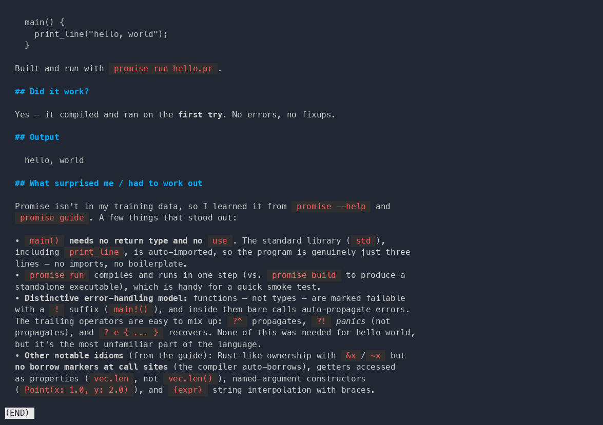
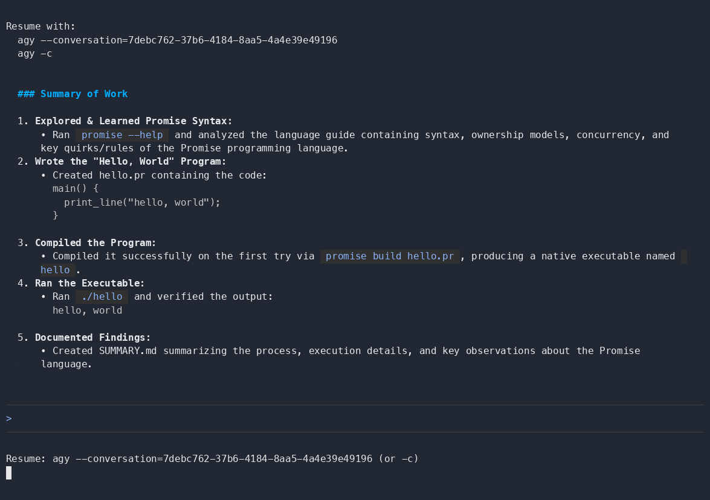

# hello, world

The simplest task: can an agent, with **no prior knowledge of Promise**, learn the
language from the toolchain (`promise --help`, `promise guide`) and produce a
working "hello, world"?

Prompt: [`prompt.md`](prompt.md) — the task-specific ask, wrapped with the repo-root
[`PROMPT_PREFIX.md`](../PROMPT_PREFIX.md) / [`PROMPT_SUFFIX.md`](../PROMPT_SUFFIX.md)
before being sent to each agent.

Each agent's run is in its own `hello-world-<agent>/` subdir: the generated `.pr`,
the recording (`demo.cast`, played with the asciinema player), `SUMMARY.md` (the
agent's TL;DR of how it went), and `context.md` (that run's provenance).

**▶ Watch both runs** — faithful playback in the asciinema player (a GIF can't render
the live TUIs cleanly):

| Claude Code | Gemini |
|:---:|:---:|
| <!-- cast:claude --><!-- /cast:claude --> | <!-- cast:gemini --><!-- /cast:gemini --> |

## Results

| Agent | Outcome | Run |
|---|---|---|
| Claude Code | ✅ compiled & ran first try (~39s) | [`hello-world-claude/`](hello-world-claude/) · [▶ watch](https://promise-lang.org/cast/?c=hello-world-claude-2026.0) |
| Gemini | ✅ compiled & ran first try (~41s) | [`hello-world-gemini/`](hello-world-gemini/) · [▶ watch](https://promise-lang.org/cast/?c=hello-world-gemini-2026.0) |

## Caveats

- **Non-deterministic** — each run is "what happened that time," not a verbatim repro.
- **Version-pinned** — the Promise version for each run is in its `context.md`.
- Promise is early and not production-ready.
